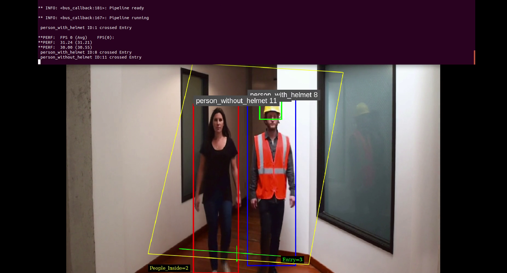
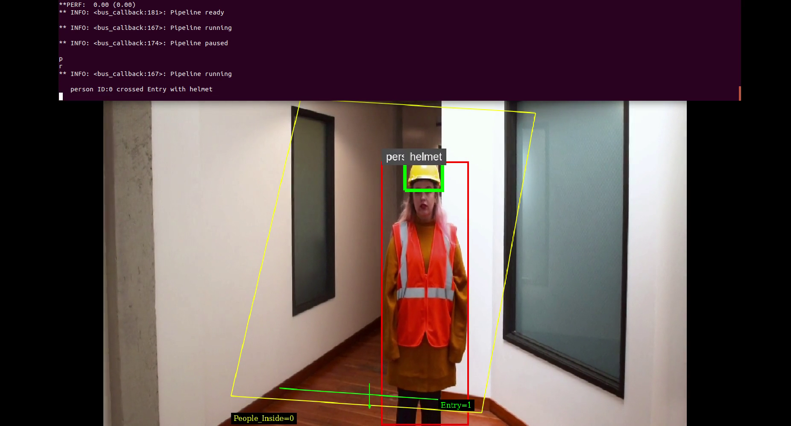

# PPE-detection
A Jetson based DeepStream application to detect,track and count people crossing with and without PPE at hazardous sites.

The application was compiled in ubuntu 18.04 system with Nvidia Cuda 10.2 + CuDNN 8.05 , TensorRT 7.0.0 and Deepstream 5.0. 
Tested on Jetson Nano and TX2 with Jetpack 4.4

## Applications
This repo contains two applications for different use cases.

### 1. PPE-primary application



- When a person crosses a line following labels are detected
  1) helmet
  2) person_with_helmet
  3) person_without_helmet

- At the instace of a person crossing a user-defined line/region, the person is counted as person_with helmet or person_without_helmet.

### 2. PPE-secondary application


- This application is intented when we have data only for the PPE objects. Not all the time we will be able to get images of PPE with/without person.

- It uses peoplnetv2 as primary inference engine and our custom model to detect helmets as secondary inference engine.
- People are detected using peoplenetv2.
- The detected region is passed to secondary inference engine for detecting helmets.
- At the instace of a person crossing if the secondary inference detects helmet then its counted as person_with_helmet.
- At the instace of a person crossing if the secondary inference does not detect helmet then its counted as person_without_helmet.

## Deepstream Setup

Documentation to setup Jetson Device can be found [here](https://docs.nvidia.com/jetson/jetpack/install-jetpack/index.html).

### 1. Install System Dependencies

```sh
sudo apt install \
libssl1.0.0 \
libgstreamer1.0-0 \
gstreamer1.0-tools \
gstreamer1.0-plugins-good \
gstreamer1.0-plugins-bad \
gstreamer1.0-plugins-ugly \
gstreamer1.0-libav \
libgstrtspserver-1.0-0 \
libgstrtspserver-1.0-dev \
libjansson4=2.11-1 \
libjson-glib-dev \
libgstreamer1.0-dev

```

### 2. Install Deepstream

Download [Deepstream 5.0](https://developer.nvidia.com/assets/Deepstream/5.0/ga/secure/deepstream_sdk_5.0.1_amd64.deb) and run 
sudo apt install ./<deepstream_deb_file>.deb


## Run Application
Clone the repository.
    ````
    $ git clone https://github.com/Maouriyan/PPE-detection-deepstream.git
    $ cd PPE-detection-deepstream/ppe-application/
    ````
Make : One Makefile will make both applications , you can also make respective applications using the Makefile in respective folders.
    ````
    $ sudo make
    $ sudo make install
    ````
Run the PPE-primary application.
     ````
    $ cd primary-app/
    $ sudo ./ppe-primary -c ../../configs/ppe_primary.txt -t
    ````
Run the PPE-secondary application.
     ````
    $ cd secondary-app/
    $ sudo ./ppe-secondary -c ../../configs/ppe_secondary.txt -t
    ````

Note: If you are using the device headless , disable EGL sink at configs/ppe_primary.txt

 ````
 [sink0]
 enable=0
 #Type - 1=FakeSink 2=EglSink 3=File
 type=2
 sync=1
 source-id=0
 
 [osd]
 enable=0
 gpu-id=0

 ````
 
## Test Results


 
 
 
